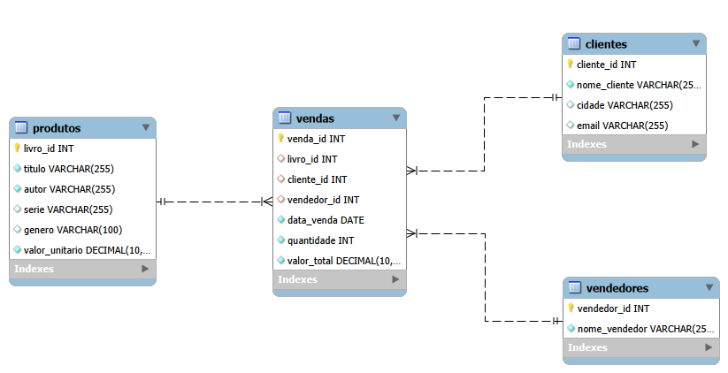
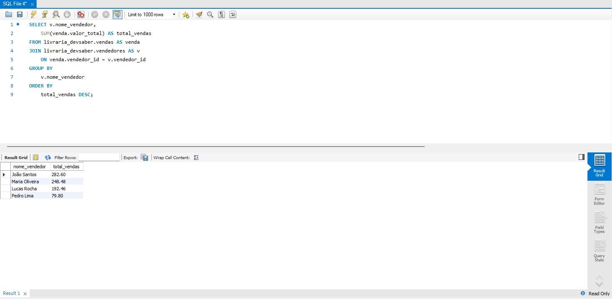
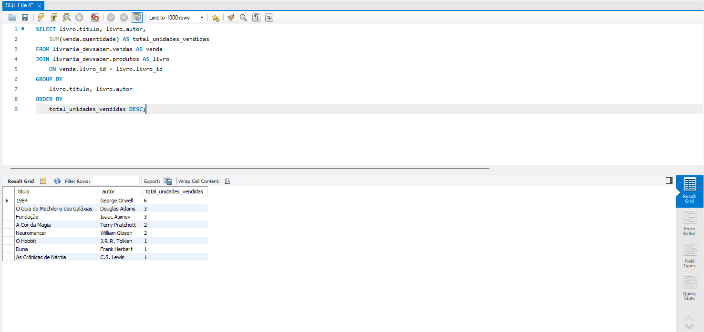
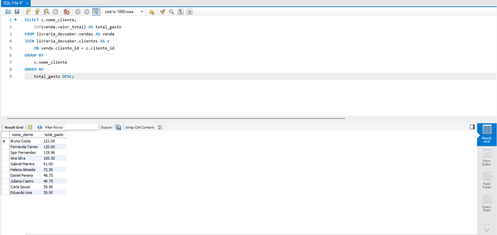
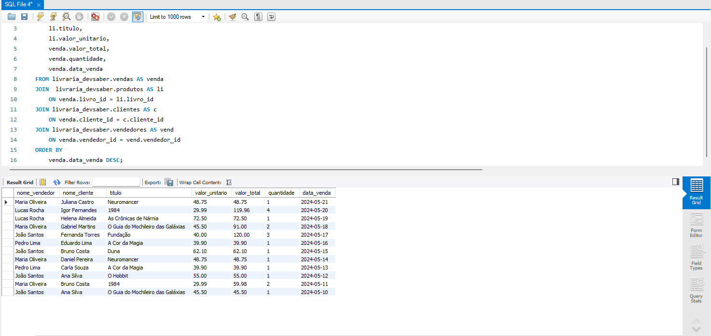

# 📚 Livraria DevSaber — Mini Projeto SQL

> Projeto desenvolvido durante o **Programa Desenvolve**, uma parceria entre o **Grupo Boticário** e a **Escola Koru**, com foco em formação e inclusão de talentos em tecnologia.

---

## 🎓 Contexto

Este projeto foi criado como parte da **Jornada de Especialização em Engenharia de Dados** (160h), dentro do Programa Desenvolve. O objetivo era aplicar na prática os fundamentos de SQL e modelagem de dados, simulando o banco de dados de uma livraria fictícia chamada **DevSaber**.

O projeto original foi desenvolvido em equipe utilizando o **Google BigQuery**. Após o encerramento do programa e a perda de acesso ao ambiente da escola, o projeto foi **refatorado e migrado para MySQL**, garantindo assim sua preservação e continuidade no portfólio.

### 🏅 Certificações obtidas no programa

| Certificado | Carga Horária | Data |
|---|---|---|
| Jornada de Especialização em Engenharia de Dados | 160h | 27/10/2025 |
| Jornada em Tech do Programa Desenvolve | 20h | 23/05/2025 |

---

## 🗂️ Estrutura do Projeto

```
livraria-devsaber/
│
├── querys/
│   ├── analise_vendas_vendedor.png     # Resultado: total de vendas por vendedor
│   ├── livros_mais_vendidos.png        # Resultado: livros mais vendidos
│   ├── gastos_cliente.png              # Resultado: clientes que mais gastaram
│   └── detalhes_vendas.png             # Resultado: detalhes completos das vendas
│
├── archive/                            # Arquivos de referência e versão original
│
├── queries_and_views.sql               # Consultas analíticas e criação de Views
├── setup_database.sql                  # Criação do banco de dados e tabelas
├── seed_data.sql                       # Inserção dos dados de exemplo
├── tabelas.png                         # Diagrama do banco de dados (MySQL Workbench)
└── README.md
```

---

## 🏗️ Modelagem do Banco de Dados

O banco de dados `livraria_devsaber` é composto por **4 tabelas** relacionadas entre si:





### Tabelas

**`produtos`** — Catálogo de livros disponíveis
| Coluna | Tipo | Descrição |
|---|---|---|
| livro_id | INT (PK) | Identificador do livro |
| titulo | VARCHAR(255) | Título do livro |
| autor | VARCHAR(255) | Nome do autor |
| serie | VARCHAR(255) | Série/coleção (opcional) |
| genero | VARCHAR(100) | Gênero literário |
| valor_unitario | DECIMAL(10,2) | Preço unitário |

**`clientes`** — Cadastro de clientes
| Coluna | Tipo | Descrição |
|---|---|---|
| cliente_id | INT (PK) | Identificador do cliente |
| nome_cliente | VARCHAR(255) | Nome completo |
| cidade | VARCHAR(255) | Cidade de origem |
| email | VARCHAR(255) | E-mail de contato |

**`vendedores`** — Equipe de vendas
| Coluna | Tipo | Descrição |
|---|---|---|
| vendedor_id | INT (PK) | Identificador do vendedor |
| nome_vendedor | VARCHAR(255) | Nome do vendedor |

**`vendas`** — Registro das transações
| Coluna | Tipo | Descrição |
|---|---|---|
| venda_id | INT (PK) | Identificador da venda |
| livro_id | INT (FK) | Referência ao livro vendido |
| cliente_id | INT (FK) | Referência ao cliente |
| vendedor_id | INT (FK) | Referência ao vendedor |
| data_venda | DATE | Data da transação |
| quantidade | INT | Quantidade de exemplares |
| valor_total | DECIMAL(10,2) | Valor total da venda |

---

## 🔍 Consultas Analíticas

### 1. Total de Vendas por Vendedor
Ranking dos vendedores pelo valor total gerado em vendas.



---

### 2. Livros Mais Vendidos
Lista os livros ordenados pela quantidade de unidades vendidas.



---

### 3. Clientes que Mais Gastaram
Identifica os clientes com maior volume de compras.



---

### 4. Detalhes Completos das Vendas
Combina todas as tabelas para exibir uma visão completa de cada transação.



---

## 👁️ View Criada

Uma **View** foi criada para encapsular a consulta de detalhes completos e facilitar reutilização:

```sql
CREATE VIEW livraria_devsaber.vw_detalhes_vendas AS
SELECT venda.venda_id, venda.data_venda,
    li.titulo AS titulo_livro, li.autor AS autor_livro,
    li.valor_unitario, venda.quantidade, venda.valor_total,
    c.nome_cliente, vend.nome_vendedor
FROM livraria_devsaber.vendas AS venda
JOIN livraria_devsaber.produtos AS li ON venda.livro_id = li.livro_id
JOIN livraria_devsaber.clientes AS c ON venda.cliente_id = c.cliente_id
JOIN livraria_devsaber.vendedores AS vend ON venda.vendedor_id = vend.vendedor_id;

-- View:
SELECT * FROM livraria_devsaber.vw_detalhes_vendas;
```

---

## 🚀 Como Executar

1. Certifique-se de ter o **MySQL** instalado e em execução
2. Execute os scripts na seguinte ordem:

```bash
Com o **MySQL Workbench** aberto, execute os arquivos nessa ordem:
 
1. `setup_database.sql` — cria o banco e as tabelas
2. `seed_data.sql` — insere os dados de exemplo
3. `queries_and_views.sql` — roda as consultas e cria a View

```

> 💡 Você também pode executar cada arquivo manualmente pelo **MySQL Workbench** ou qualquer outro cliente SQL de sua preferência.

---

## 🛠️ Tecnologias Utilizadas
 
| Tecnologia | Uso |
|---|---|
| Google BigQuery | Desenvolvimento original do projeto |
| MySQL | Refatoração e versão final do portfólio |
| MySQL Workbench | Interface gráfica para execução e visualização |
| SQL | Linguagem de consulta e modelagem |

---

## 📖 Sobre o Programa Desenvolve

O **Programa Desenvolve** é uma iniciativa do **Grupo Boticário** em parceria com a **Escola Koru**, voltada para formação e inclusão de talentos em tecnologia. A jornada de Engenharia de Dados contemplou os seguintes temas:

- Fundamentos de Python para Análise de Dados
- Fundamentos de Dados e SQL
- Construção de Portfólio com GitHub
- IA e Prompt Engineering
- Estatística e Visualização de Dados

---

## 👤 Autor

**Carlos Diego Barbosa do Nascimento**

[](https://linkedin.com/in/carlosdiego-nascimento/)
[](https://github.com/carlosd-nascimento)

---

> *Este projeto foi desenvolvido originalmente em equipe durante o Programa Desenvolve (2025). Após o encerramento do programa, foi refatorado individualmente e migrado do BigQuery para MySQL para fins de portfólio.*
